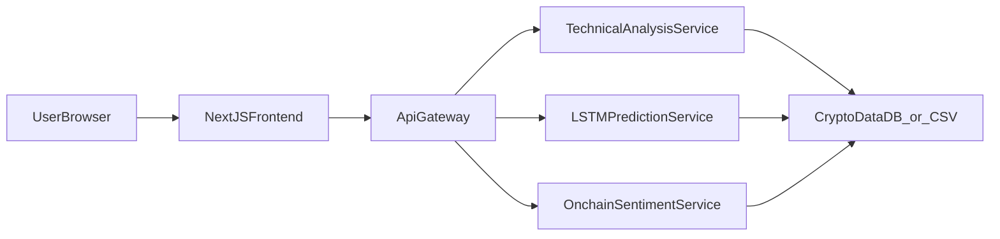

## Design Patterns and Architecture – Homework 4

### Strategy Pattern

- **Where**: `backend/analytics/strategies/`
  - `base.py` – defines the common `AnalyticsStrategy` interface with `analyze(df, symbol, **kwargs)`.
  - `technical.py` – `TechnicalAnalysisStrategy` computes moving averages, oscillators and signals.
  - `lstm.py` – `LSTMPredictionStrategy` trains/uses an LSTM model for next-close prediction.
  - `onchain.py` – `OnchainSentimentStrategy` calculates on-chain metrics, sentiment and a combined signal.
- **Why**:
  - Each analytics algorithm (technical indicators, LSTM, on-chain/sentiment) is encapsulated in its own strategy class.
  - The rest of the system depends only on the **common interface**, so strategies can be extended or replaced without touching the API or frontend.
  - This improves **readability**, **reusability**, and makes analytics logic easy to test in isolation.

### Facade Pattern

- **Where**: `backend/analytics/facade.py`
  - `AnalyticsFacade` aggregates the three strategies and exposes high-level methods:
    - `get_technical(symbol, df, timeframe)`
    - `get_prediction(symbol, df, lookback, epochs, use_cache)`
    - `get_onchain_sentiment(symbol, df)`
- **Why**:
  - The API Gateway and microservices do not need to know about individual strategies or helper functions.
  - They call a **single, simple API** on the facade, which hides data preparation and strategy coordination.
  - This keeps the service endpoints small, clear and easier to maintain.

### Microservices Overview

- **API Gateway (`api_gateway`)**
  - Endpoints:
    - `/coins`, `/coins/{id}`, `/coins/{id}/history`, `/compare`
    - `/coins/{id}/technical` → forwards to Technical Analysis service
    - `/coins/{id}/predict` → forwards to LSTM Prediction service
    - `/coins/{id}/onchain-sentiment` → forwards to On-chain & Sentiment service
  - Responsibilities:
    - Single public entry point for the frontend.
    - Directly reads from the shared SQLite DB for market data.
    - Delegates analytics to dedicated services via HTTP.

- **Technical Analysis Service (`technical_analysis_service`)**
  - Endpoint: `/technical/{symbol}`
  - Responsibilities:
    - Load OHLCV data for a symbol from SQLite.
    - Use `AnalyticsFacade.get_technical` (Strategy) to compute indicators and signals.

- **LSTM Prediction Service (`lstm_prediction_service`)**
  - Endpoint: `/predict/{symbol}`
  - Responsibilities:
    - Load OHLCV data for a symbol.
    - Use `AnalyticsFacade.get_prediction` (Strategy) to train/load LSTM and return prediction + metrics.

- **On-chain & Sentiment Service (`onchain_sentiment_service`)**
  - Endpoint: `/onchain-sentiment/{symbol}`
  - Responsibilities:
    - Load OHLCV data for a symbol.
    - Use `AnalyticsFacade.get_onchain_sentiment` (Strategy) to calculate:
      - On-chain metrics (active addresses, flows, NVT, MVRV, etc.)
      - Sentiment metrics (positive/neutral/negative, score, label)
      - Combined bullish/bearish/neutral signal.

- **Frontend (`frontend`)**
  - Next.js app calling **only the API Gateway** via `NEXT_PUBLIC_API_URL`.
  - Reuses the same routes as Homework 3, but now behind the gateway.

### Shared Data Access

- **Where**: `backend/common/db.py`, `backend/config.py`
  - `get_connection()` returns a SQLite connection with `sqlite3.Row`.
  - Database path comes from:
    - `CRYPTO_DB_PATH` environment variable (preferred), or
    - `config.DB_NAME` (points to Homework 3 `crypto_data.db`).
- **Why**:
  - All services share the same historical OHLCV data populated by Homework 3.
  - Centralizing DB access logic avoids repetition and keeps the code consistent.

### Architecture Diagram

- **Flow**:
  1. User interacts with the Next.js UI.
  2. Frontend calls the API Gateway (`/coins`, `/coins/{id}`, `/compare`, etc.).
  3. Gateway:
     - Reads market data directly from the shared DB.
     - For analytics endpoints, forwards to the respective microservice.
  4. Microservices read from the same DB and apply analytics strategies.
  5. Results are returned to the Gateway and then to the frontend.

### Docker & Local Run Instructions

- **Build and run all services locally**:
  - From the `Homework4` directory:
    - `docker-compose build`
    - `docker-compose up`
  - Services:
    - API Gateway: `http://localhost:8000`
    - Frontend: `http://localhost:3000`
    - Technical Analysis: `http://localhost:8001`
    - LSTM Prediction: `http://localhost:8002`
    - On-chain & Sentiment: `http://localhost:8003`
  - The Docker Compose file mounts the Homework 3 SQLite DB:
    - Host path: `../homework3/crypto_data.db`
    - Container path: `/data/crypto_data.db`
    - Environment: `CRYPTO_DB_PATH=/data/crypto_data.db`

### Azure Deployment (High-Level)

These are high-level steps; actual portal/CLI clicks can vary slightly:

1. **Create Azure resources**
   - Create an Azure Container Registry (ACR).
   - Create an Azure Container Apps environment or Web App for Containers.

2. **Build and push images**
   - Log in to ACR:
     - `az acr login --name <your_acr_name>`
   - Tag and push images (from `Homework4`):
     - `docker-compose build`
     - Tag each image for ACR, e.g.:
       - `docker tag homework4_api-gateway <acr>.azurecr.io/api-gateway:hw4`
       - `docker push <acr>.azurecr.io/api-gateway:hw4`
     - Repeat for:
       - `technical-analysis-service`
       - `lstm-prediction-service`
       - `onchain-sentiment-service`
       - `frontend`

3. **Deploy containers**
   - Create a Container App / Web App for each service, or use a single multi-container configuration (depending on the chosen Azure service).
   - Configure environment variables:
     - `CRYPTO_DB_PATH` (if you mount a volume with the DB).
     - `TECH_SERVICE_URL`, `LSTM_SERVICE_URL`, `ONCHAIN_SERVICE_URL` inside the gateway.
     - `NEXT_PUBLIC_API_URL` inside the frontend (pointing to the public gateway URL).
   - Expose:
     - API Gateway HTTP port (e.g. 8000) publicly.
     - Frontend port (3000) publicly or via the same app.

4. **Connect frontend to gateway**
   - Set `NEXT_PUBLIC_API_URL` (Azure App Setting) to the public URL of the API Gateway, e.g.:
     - `https://<your-gateway-app>.azurewebsites.net`

5. **Homework note**
   - Homework 3 deployment and code remain unchanged in `homework3/`.
   - Homework 4 microservice-based deployment uses a **new URL**, which you can paste here:
     - `HW4 Deployment URL: <paste Azure URL here>`

